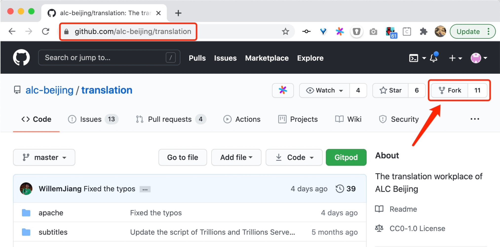
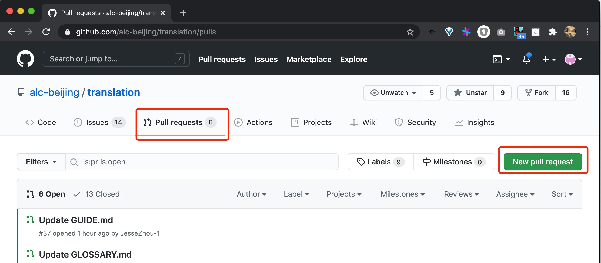

## 准备工作

> 如果您没有技术背景，请移步 [工作流程（非技术背景）](WORKFlOW-NO-TECH.md)

* Terminal
* [Git](https://git-scm.com/)
* [GitHub](https://github.com/)


## 工作流程



### 1. 认领任务

访问 [issue](https://github.com/alc-beijing/translation/issues) 页面，标题以`[翻译]`开头的 issue 为翻译任务，选择未分配的 issue 评论 `/accept` 领取任务，被标记为 `Assignees` 即领取成功。

@TODO: image

### 2. Fork 项目

访问 [alc-beijing/translation](https://github.com/alc-beijing/translation) 项目页面，点 `Fork` 克隆项目。




### 3. Clone 到本地

打开终端，Clone 项目到本地 `~/alc-beijing/translation` (本地路径可自定义)：

```sh
$ git clone https://github.com/<你的github名称>/translation ~/alc-beijing/translation
```

### 4. 创建分支

```sh
$ cd ~/alc-beijing/translation
$ git remote add upstream https://github.com/alc-beijing/translation.git  # clone 项目后只需执行一次，以后不需要重复执行
$ git fetch upstream master:<自定义分支名> 
$ git checkout <自定义分支名> # 分支名建议使用：<github-id>/<issue-id> 或 <github-id>/<文档关键词>
```

### 5. 本地翻译

略

工具推荐：
* [Google Translate](https://translate.google.com/)
* [Bing Translator](https://www.bing.com/translator)
* [DeepL](https://www.deepl.com/en/translator)
* [Tatoeba](https://tatoeba.org/eng/sentences/search?query=translate&from=eng&to=cmn)
* [TencentDocs](https://docs.qq.com/)
* [Youdao](http://youdao.com/)

### 6. 推送到远程

```sh
$ git push origin <自定义分支名>
```


### 7. 创建 PR

创建 PR 时，可通过 `# issue-id` 引用 issue 链接, 可参考以下文档：
* [Referencing issues and pull requests](https://docs.github.com/en/free-pro-team@latest/github/writing-on-github/basic-writing-and-formatting-syntax#referencing-issues-and-pull-requests)
* [Autolinked references and URLs](https://docs.github.com/en/free-pro-team@latest/github/writing-on-github/autolinked-references-and-urls)

[Issue 实例](https://github.com/alc-beijing/translation/pull/12)




### 8. Review

@TODO: Reviewer list

### 9.  合并到主干

@TODO: Merge rules


## Reference

* [Envoy 中文文档翻译指导手册](https://github.com/cloudnativeto/envoy/blob/zh/docs/root/README.md)
